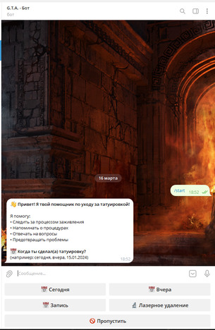
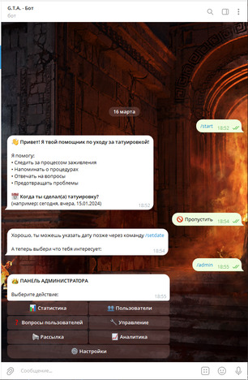
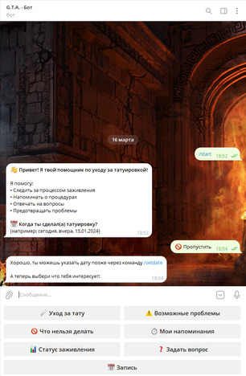

# 🤖 Tattoo Care Bot

**Telegram-бот для ухода за татуировками** — твой персональный помощник, который подскажет, как правильно ухаживать за свежей татуировкой, напомнит о важных процедурах и ответит на вопросы. Работает 24/7 на хостинге Render с использованием вебхуков и пробуждением через cron-job.org.

## 🔗 Ссылки

- **Бот в Telegram:** [@tattoo_care_bot](https://t.me/tattoo_care_bot)
- **QR-код**:  
  

## 📸 Скриншоты

### Главное меню


##*С командами записи или онлайнконсультации*

### Админ-панель


##*Командная панель администратора*

### Список команд


##*Список команд - Для пользователей*


## ✨ Возможности

### 👤 Для пользователей
- 🩹 **Уход за тату** — этапы заживления и рекомендации
- ⚠️ **Возможные проблемы** — диагностика и советы
- 🚫 **Что нельзя делать** — правила поведения
- ⏱ **Мои напоминания** — настройка уведомлений
- 📊 **Статус заживления** — отслеживание прогресса
- ❓ **Задать вопрос** — отправка вопросов администратору
- 📅 **Запись** — на запись к мастеру
- 🔬 **Лазерное удаление** — информация об удалении

### 👑 Для администратора
- 📊 **Статистика** — общая статистика по боту
- 👥 **Управление пользователями** — просмотр, фильтрация, экспорт
- ❓ **Управление вопросами** — ответы на вопросы пользователей
- 📢 **Рассылки** — отправка сообщений пользователям
- 📈 **Аналитика** — графики роста и активности
- 🗄️ **База данных** — настройки и резервное копирование
- 📋 **Системные логи** — просмотр и фильтрация логов
- ⚙️ **Настройки** — управление правами, уведомлениями, языком

## 🛠 Стек технологий

- **Node.js** — среда выполнения
- **Telegraf.js** — библиотека для Telegram Bot API
- **MongoDB + Mongoose** — база данных и ODM
- **Express.js** — веб-сервер (для вебхуков)
- **node-cron** — планировщик задач (напоминания, очистка логов)
- **Render** — хостинг и деплой
- **cron-job.org** — пробуждение бота
- **dotenv** — управление переменными окружения

## 🔧 Установка и запуск локально
1. **Клонируйте репозиторий:**
   ```bash
   git clone https://github.com/alexpankov87/tattoo_care_bot.git
   cd tattoo_care_bot
Установите зависимости:
npm install

Создайте файл .env в корне проекта:
env

##BOT_TOKEN=токен_вашего_бота_от_BotFather

##MONGODB_URI=строка_подключения_к_MongoDB

##ADMIN_ID=ваш_telegram_id (главный администратор)

##PORT=3000

##WEBHOOK_URL=https://ваш-домен.com/webhook  # для продакшена на Render

Запустите бота:
node index.js
Или с автоматическим перезапуском (nodemon):

npm install -g nodemon
nodemon index.js

##☁️ Деплой на Render

Бот успешно развёрнут на платформе [Render](https://render.com) с использованием вебхуков (не long polling). 
Это обеспечивает стабильную работу и экономию ресурсов.
Особенности бесплатного тарифа Render
Приложение автоматически переходит в спящий режим после 15 минут бездействия.
Чтобы бот всегда был активен и мгновенно отвечал пользователям, настроен внешний мониторинг через cron-job.org.
##Как работает пробуждение?
На cron-job.org создана задача, которая каждые 5 минут отправляет GET-запрос на вебхук бота (https://твой-бот.render.com/webhook).
Render получает запрос и пробуждает приложение, если оно спало.
Бот обрабатывает запрос (просто возвращает 200 OK) и остаётся активным ещё минимум 15 минут.
Таким образом, бот практически всегда в рабочем состоянии, а пользователи не замечают задержек.
Процесс деплоя на Render
Создайте новый Web Service на Render.
Подключите репозиторий.
##Укажите команду запуска: node index.js.
Добавьте переменные окружения (BOT_TOKEN, MONGODB_URI, ADMIN_ID, WEBHOOK_URL).
В настройках укажите Auto-Deploy для автоматического обновления при пушах в GitHub.
После деплоя получите URL вида https://tattoo-care-bot.onrender.com.
Настройте вебхук в боте (Render сделает это автоматически, если указан WEBHOOK_URL).
Создайте задачу на cron-job.org с URL https://tattoo-care-bot.onrender.com/webhook и интервалом 5 минут.

##⏰ Планировщик cron

В боте используется node-cron для выполнения задач по расписанию:
Ежедневная рассылка напоминаний пользователям
Очистка устаревших логов
Обновление статистики
Все задачи настраиваются через код и не требуют ручного вмешательства.

##🔐 Безопасность
Все чувствительные данные (токены, пароли, ID) хранятся в переменных окружения и не попадают в репозиторий.
Файл .env добавлен в .gitignore.
Права администраторов гибко настраиваются через базу данных.
